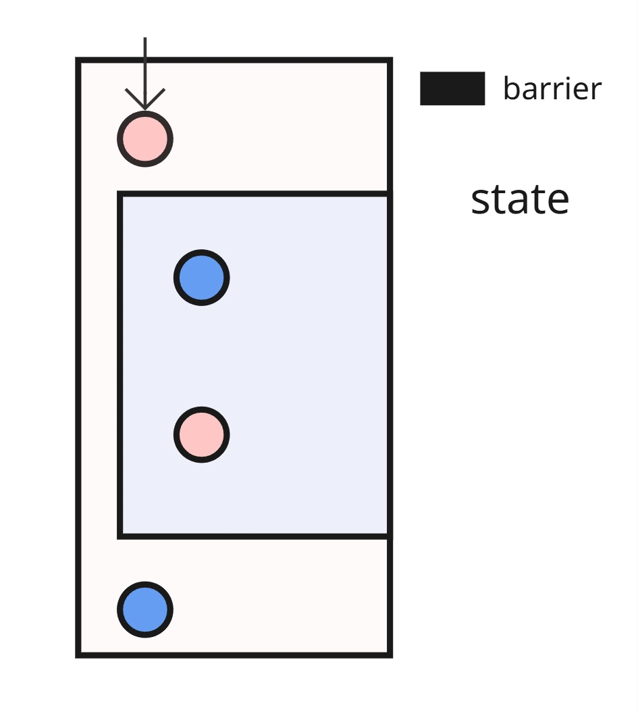
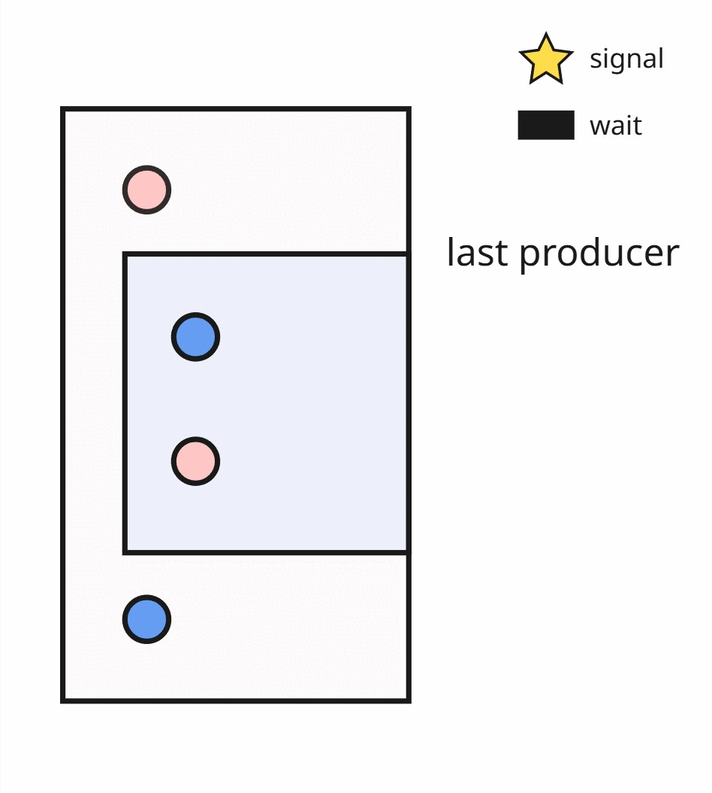

How are shared memory barriers inserted in wave
=============================================================

We want to automatically insert shared-memory barriers so that read/write/atomics on the same LDS (shared memory) region are ordered correctly.
To be more specific, cases like RAW (read after write), WAR (write after read), or touch memory via atomics, we must synchronize to avoid races and hangs. On gfx94, gfx95, we support basic shared memory barriers via `amdgpu.lds_barrier`; on gfx120x we prefer split barriers (Signal / Wait), split barriers are supported via lowering to `rocdl.s.wait_dscnt`, `rocdl.s.barrier.signal`, and `rocdl.s.barrier.wait`.

Glossary
--------------------
- Memory Access Types
    * Read (READ)
    * Write (WRITE)
    * Atomic (READ_WRITE)
    * GatherToLDS (READ_WRITE)

- Nested region op types
    * Iterate
    * Conditional

- Split barriers: two-part synchronization using signal (after producer) and wait (before consumer), supported on gfx12 targets.

- RAW / WAR hazards: classic shared memory hazards (Write→Read and Read→Write), this is represented as a closed interval in the pass (SyncRequirement).

**Note.** We will use producer to refer to an access type operator that takes ownership of a shared memory region for a period of time; consumer to refer to an access type operator that operates on the same shared memory region and therefore needs to synchronize before the producer releases it.

When do we need a barrier?
--------------------
- Basic shared memory barrier
    * If access types of producer and consumer are different. -> insert a barrier in front of the consumer node.

- GFX12 split barrier
    * If access types of producer and consumer are different. -> insert a signal after the producer and a wait before the consumer.

- READ_WRITE is involved {acts like both a producer and a consumer}
    * If it has a producer then this node will be treated like a consumer.
    * If it has a consumer then this node will be treated like a producer.
    * Either case, barriers are expected to be inserted with the logic described above.

Visualization: add_shared_memory_barriers
--------------------
- Basic barrier

The above gif is a visual illustration for inserting shared memory barriers between producers and consumers.

- Split barrier

The above gif is a visual illustration for inserting split barriers between producers and consumers.

Key Ideas:
--------------------
- A hazard is a producer–consumer relationship on shared memory that needs ordering.
- We model hazards as intervals (windows).
- minimize_placement_strategy is aimed at monolithic barriers (e.g., amdgpu.lds_barrier) and greedily places the fewest barriers before consumers by sorting on right endpoints.
- find_intersecting_interval_strategy is designed for split barriers: it coalesces hazard windows into the smallest feasible intersection and emits signal/wait pairs only when necessary.

Public API:
--------------------
.. code-block:: python

   add_shared_memory_barriers(trace: CapturedTrace, target: str = "") -> None

- Input: a captured FX trace and an optional target string.
- Effect: analyzes the trace, generates synchronization requirements, and emits barriers appropriate for the target.

Implementation:
--------------------
Target
--------------------
  TargetConfig describes what barriers to emit (monothlitic or split).

Analysis
--------------------
  We first compute a topological enumeration (_topo_location) across nodes, then scan for hazards over shared memory resources:
    - Core: implementation is defined in `handle_hazard` function. This function scans a linearized sequence of FX nodes, and discovers producer–consumer hazards on the same shared memory resource. For each resource, it groups accesses into episodes (a run of one or more producers followed by one or more consumers) and emits a SyncRequirement describing where synchronization is needed (RAW/WAR), including whether the hazard is cross iteration.
    - Procedure:
        1. Identify shared-memory accesses (Read, Write, Atomic, GatherToLDS) and classify them as READ, WRITE, or READ_WRITE.
        2. Track producer/consumer "episodes" per memory resource.
        3. Create SyncRequirement records capturing:
            - the producer region and the consumer region
            - their topological positions
            - whether the hazard crosses an iteration boundary (is_loop)
            - boundary nodes of the surrounding graph
        4. RAW hazards are tagged with BarrierType.FILL, WAR with BarrierType.READY (for easier debugging and potential future guard usage)

    Cross-iteration hazards: For nested regions, hazards can connect iteration N to iteration N+1 (e.g., read(i+1) after write(i)). To catch these, handle_hazard:
        - Duplicates the sequence (nodes = nodes * 2) so that “next iteration” uses of the same logical resource appear later in the stream.
        - Computes a depth flag (0 or 1) for each occurrence so get_shared_memory_from_op can “shift” loop carried operands from iteration i to i+1.
        - With this setup, a producer at position p and a consumer at position c will look like p < c for intra iteration hazards, and like p > c (i.e., is_loop=True) for cross iteration hazards. These are tagged in the requirement for placement to handle specially.

Placement strategies
--------------------
We'll use `window` to refer to a SyncRequirement hazard interval, the interval is defined by the topological positions between a producer and a consumer.

2 strategies are currently available; both take a list of SyncRequirement and return a reduced set of barrier placement positions.
    - Minimize placement (minimize_placement_strategy):
        - Intent: Use the fewest possible barriers, placed before consumers.
        - Procedure:
            1. Sort all SyncRequirements by their endpoints. (earliest barrier requirements)
            2. Walk all windows in 1. order and check
                - If a window is already covered by a previously-placed barrier, skip it
                - Otherwise, this is an uncovered region, so we place one barrier.
            3. Finally for "cross-iteration" hazards, we check for barrier coverage from 1) the graph start position to the window endpoint, 2) the window start point to the graph end position.

    - Find intersecting intervals (find_intersecting_interval_strategy):
        - Intent: Given a set of synchronization requirements (“hazard windows”) between a producer and a consumer operating on the same LDS (shared) memory region, we want to place one signal (after the producer) and one wait (before the consumer) so that: 1) Every consumer that could race with a producer waits for a matching signal, 2) No wait can appear before its corresponding signal, and 3) We use as few split barrier pairs as possible without over serializing the schedule.
        - Core: If two windows overlap, a single split barrier pair can satisfy both: signal after the latest producer seen so far (the largest L); wait before the earliest consumer (the smallest R).
        - Procedure:
            1. Sort all SyncRequirements by their startpoints and then their end points.
            2. Main algorithm: scan and intersect
                - Maintain a running intersection `sig_pos` and `wait_pos`.
                - For each window, update the intersection variables.
                - If the intersection becomes empty (`sig_pos` >= `wait_pos`), we emit the previous pair and start a new intersection.
                - After the scan, emit the last pending pair.
            3. For cross-iteration hazards
                - If wait is already covered from `graph start` to window end position and signal is already covered from `graph end` to window start position, skip.
                - If wait is covered, but signal is not: add signal as normal, add wait at graph end.
                - Otherwise, offset the consumer topological position and run the algorithm on cross-iter hazards.
                In case when we did add a cross-iter barrier (wait has position before signal), we add a signal-wait pair surrounding the subgraph.

Emission
--------------------
A small dispatcher selects an emitter based on TargetConfig:
- LegacyBarrierEmitter (amdgpu.lds_barrier): emits monolithic SharedMemoryBarrier before the consumer.
- BasicSplitBarrierEmitter (rocdl.s.barrier.signal/rocdl.s.barrier.wait {barId: -1}) emits a signal after a producer and a wait before a consumer.
    - Verification: Scanning the pre-order traversal of the full nested graph.
        - no wait appears before its corresponding signal,
        - only a single barrier ID is used (-1),
        - no orphaned signals remain.

End-to-End flow
--------------------
- Build TargetConfig from target string.
- Walk the graph in the pre-order manner and assign _topo_location.
- Run get_barriers_analysis function to get a list of SyncRequirements.
- BarrierEmitter dispatch to choose Legacy or BasicSplit emitter.
- Optimize placements, then emit barriers.
- Run verify on the resulting graph to avoid GPU hangs.

Known Limitations / TODO
--------------------
We are now propagating memory access of an op in the nested-region with `depth` set to 1
